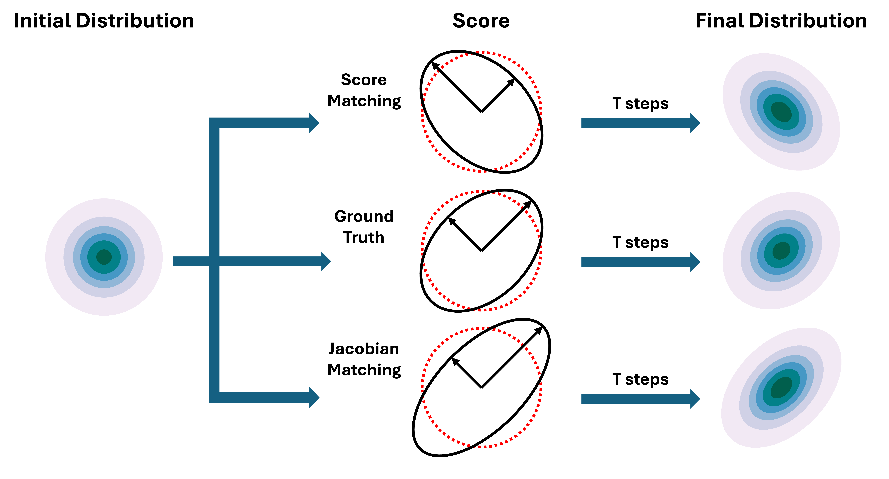
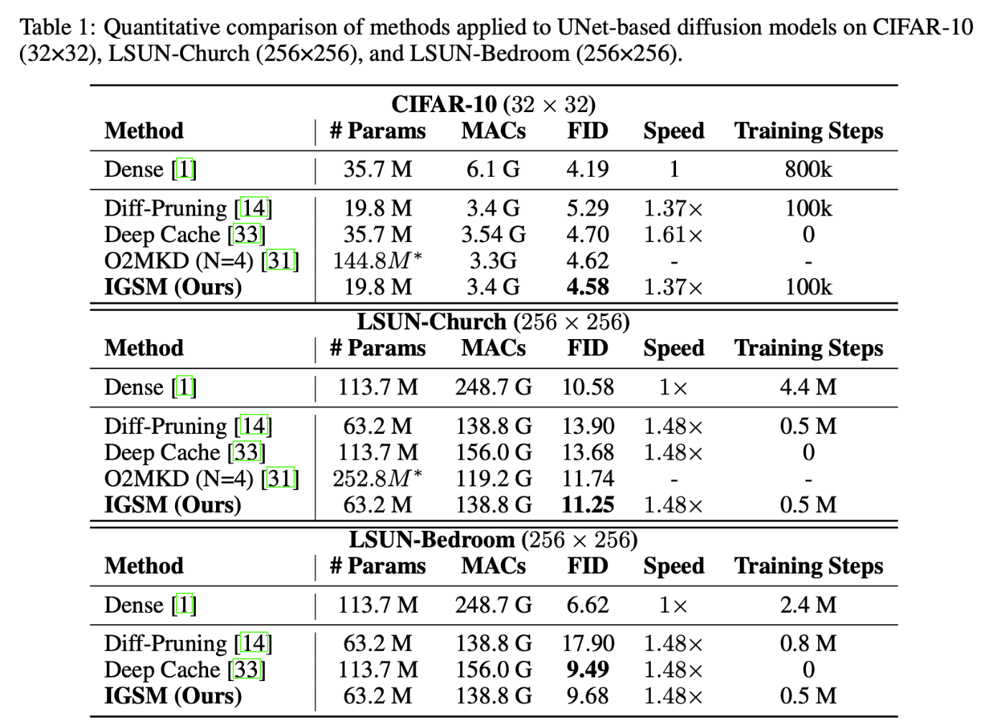

# IGSM: Improved Geometric and Sensitivity Matching for Pruned Diffusion Models

This repository provides an implementation of IGSM, a Jacobian-guided finetuning method for improving the performance of pruned diffusion models. It supports both U-Net and Transformer-based architectures and is tested on CIFAR-10, CelebA, and LSUN datasets.

<div align="center">
</img>
</div>

## 🔧 Installation

We recommend using a conda or virtual environment.

```bash
git clone https://anonymous.4open.science/r/IGSM-UNET-1D00
cd IGSM
conda create -n IGSM python=3.10
conda activate IGSM
pip install -r requirements.txt
```

### 1. Pruning
Create a pruned model at *run/pruned/ddpm_cifar10_pruned*
```bash
./scripts/prune_ddpm_cifar10.sh # generate a pruned model for finetuning
./scripts/prune_ddpm_cifar10_dense.sh # generate a dense with the same format as pruned model for KD
```

### 2. Finetuning with IGSM
Finetune the model and save it at *run/finetuned/cifar10/pruning_ratio_***
```bash
./scripts/finetune_ddpm_cifar10_pruned_diff_pruning_thr_0.04_pr_0.44.sh
```

### 3. Sampling and Evaluating
**Sampling:** Sample and save images to *run/sample/cifar10/pruning_ratio_***
**Evaluation**: Calculate FID score 
```bash
./scripts/sample_ddpm_cifar10_fid.sh
```

## Results
### 1. DDPM on Cifar-10, and LSUN
<div align="center">
</img>
</div>

## Acknowledgement

This project is heavily based on [Diffusers](https://github.com/huggingface/diffusers), [Torch-Pruning](https://github.com/VainF/Torch-Pruning), [pytorch-fid](https://github.com/mseitzer/pytorch-fid) and [diff-pruning](https://github.com/VainF/Diff-Pruning/tree/main)